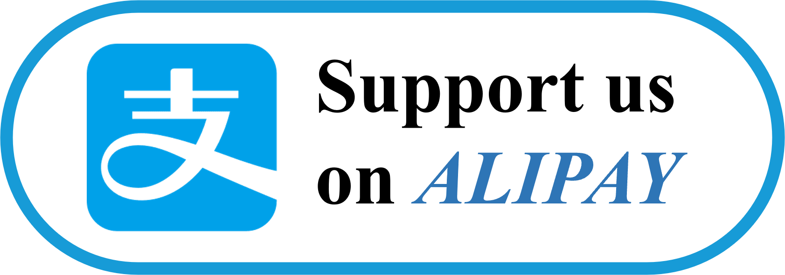

<!-- https://remixicon.com/ -->
<!-- https://simpleicons.org/ -->
<h1 align="center">Hi there, I'm Kaihua Zhang</h1>

  
  
  
  

  
  

    
    <!--  -->
    

- [About Me](#about-me)
  - [My Skills](#my-skills)
- [GitHub Analytics](#github-analytics)
  - [Open source Repo](#open-source-repo)
  - [Total Activity](#total-activity)
  - [Recent Activity](#recent-activity)

# About Me
- 🔭I am currently a graduate student at Beihang University, majoring in Chemistry. <!-- -  I’m currently working on … -->
- 🌱 I’m currently learning Machine Learning, Deep Learning, and English.
- 💬 If you have any questions, just ask me.

## My Skills

**Languages/Frameworks I'm good at:**

  
  

**Languages/Frameworks I'm learning:**

  
  
  

**Environments I work with:**

  
  
  

# GitHub Analytics

<a href="https://github.com/zhangkaihua88">
  
  
  <!-- 
   -->
</a>

## Open source Repo
- **[QuickLook](https://github.com/QL-Win/QuickLook) Plugin**

  |Name|Language|Stars|Downloads|Version|License|
  |:-:|:-:|:-:|:-:|:-:|:-:|
  |**[JupyterNotebookViewer](https://github.com/zhangkaihua88/QuickLook.Plugin.JupyterNotebookViewer)**||||||
  |**[XMindViewer-Thumbnail](https://github.com/zhangkaihua88/QuickLook.Plugin.XMindViewer-Thumbnail)**||||||
  |**[KritaVirwer-MergedImage](https://github.com/zhangkaihua88/QuickLook.Plugin.KritaVirwer-MergedImage)**||||||
  |**[CorelDrawViewer-Thumbnail](https://github.com/zhangkaihua88/QuickLook.Plugin.CorelDrawViewer-Thumbnail)**||||||
  |**[DDSViewer](https://github.com/zhangkaihua88/QuickLook.Plugin.DDSViewer)**||||||

- **Competition Repo**

  |Name|Other|Language|Stars|License|
  |:-:|:-:|:-:|:-:|:-:|
  |**[Data Competition Baseline](https://github.com/zhangkaihua88/DataCompetitionBaseline)**|||||
  |**[Data Competition Solution](https://github.com/zhangkaihua88/DataCompetitionSolution)**|||||
  |**[2022人民网人工智能算法挑战赛-微博流行度预测](https://github.com/zhangkaihua88/2022WeiboPopularityPrediction)**|Rank 1||||
  |**[2023招商银行FinTech数据赛道](https://github.com/zhangkaihua88/2023FinTech_CustomerInvestmentPrediction)**|Rank 4||||

- **Code for Book**

  |Name|Other|Language|Stars|License|
  |:-:|:-:|:-:|:-:|:-:|
  |**[Interpreting Machine Learning Models With SHAP](https://github.com/zhangkaihua88/Interpreting-Machine-Learning-Models-With-SHAP)**|<a href="https://leanpub.com/shap">book link</a>||||

- **Other Repo**

  |Name|Language|Stars|Downloads|Version|License|
  |:-:|:-:|:-:|:-:|:-:|:-:|
  |**[BUAA-Postgraduate-Aischedule](https://github.com/zhangkaihua88/BUAA-Postgraduate-Aischedule)**||||||
  |**[BUAA-Thesis-Download](https://github.com/zhangkaihua88/BUAA-Thesis-Download)**||||||

<!-- <iframe style="height:80px; width:100%;" src="https://www.zkhweb.top/HTML/connect.html" frameborder="0" scrolling="no">  </iframe> -->

<!-- # About me
## Education ⚡
- 北京航空航天大学-化学-本科-2017.09~2021.06
- 北京航空航天大学-化学-硕士-2021.09~2024.01
## Work Experience

## Awards and Achievements
- 🏆2022人民网人工智能算法挑战赛-微博流行度预测-TOP1(冠军) -->
<!--  -->

## Total Activity

- [rougier/scientific-visualization-book](https://github.com/rougier/scientific-visualization-book) PR 2 times with ${\color{green}{-6}} \ {\color{red}{+6}}$
- [dptech-corp/Uni-Mol](https://github.com/dptech-corp/Uni-Mol) PR 1 times with ${\color{green}{-1}} \ {\color{red}{+1}}$
- [freeCodeCamp/how-to-contribute-to-open-source](https://github.com/freeCodeCamp/how-to-contribute-to-open-source) PR 1 times with ${\color{green}{-1}} \ {\color{red}{+1}}$

## Recent Activity
<!--START_SECTION:activity-->
<!--END_SECTION:activity-->

<!--START_SECTION:waka-->
<!--END_SECTION:waka-->